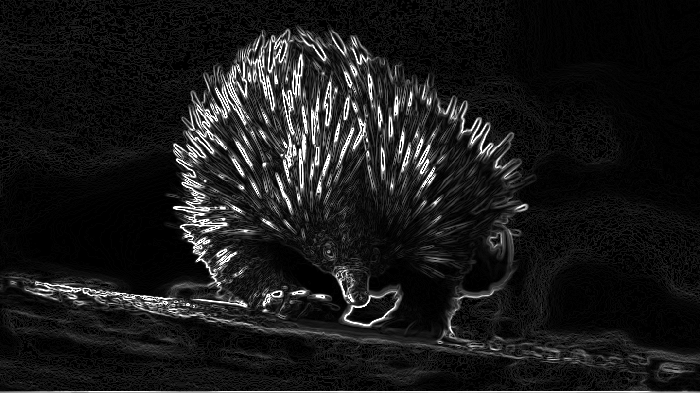

# G2ES GPU 图像处理流水线

[](https://developer.nvidia.com/cuda-toolkit)
[](https://opencv.org/)
[](#许可证)

一个基于 CUDA 加速的图像处理流水线，实现了四个经典的计算机视觉处理阶段 —— **G**rayscale（灰度化）、**G**aussian blur（高斯模糊）、**E**qualization（直方图均衡化）、**S**obel edge detection（Sobel 边缘检测），并内置 CPU 参考实现用于性能对比。

> 📖 English version: [README.md](README.md)

## 🎨 流水线演示

<table>
  <tr>
    <td align="center"><b>输入</b></td>
    <td align="center"><b>灰度化</b></td>
    <td align="center"><b>高斯模糊</b></td>
    <td align="center"><b>直方图均衡化</b></td>
    <td align="center"><b>Sobel 边缘检测</b></td>
  </tr>
  <tr>
    <td></td>
    <td></td>
    <td></td>
    <td></td>
    <td></td>
  </tr>
</table>

## 目录

- [流水线演示](#流水线演示)
- [项目概述](#项目概述)
- [流水线阶段](#流水线阶段)
- [项目结构](#项目结构)
- [环境要求](#环境要求)
- [编译构建](#编译构建)
- [使用方法](#使用方法)
- [输出文件](#输出文件)
- [架构详解](#架构详解)
- [错误处理](#错误处理)
- [性能基准测试](#性能基准测试)
- [许可证](#许可证)

## 项目概述

G2ES 加载一张图像（支持 OpenCV 所有格式：PNG、JPG、BMP、PGM、PPM 等），经过四阶段流水线处理，将中间结果和最终结果写入 PNG 文件。项目支持四种运行模式：

| 模式 | 参数 | 说明 |
|------|------|------|
| 仅 GPU | `--gpu`（默认） | 使用朴素核函数运行 CUDA 流水线 |
| GPU 优化版 | `--gpu-optimized` | 使用优化核函数运行 CUDA 流水线 |
| 仅 CPU | `--cpu` | 仅运行单线程 CPU 参考流水线 |
| 双模式对比 | `--both` | 同时运行 CPU 和 GPU（朴素版），输出加速比对比 |

## 流水线阶段

```
输入图像 → [1. 灰度化] → [2. 高斯模糊] → [3. 直方图均衡化] → [4. Sobel边缘检测] → 输出
```

| 阶段 | 算法 | 核大小 | 关键细节 |
|------|------|--------|----------|
| 1. RGB 转灰度 | 加权亮度公式 `0.299R + 0.587G + 0.114B` | — | ITU-R BT.601 标准 |
| 2. 高斯模糊 | 5×5 高斯平滑滤波 | 5×5 | 权重存储在 `__constant__` 内存中 |
| 3. 直方图均衡化 | 基于 CDF 的强度重分布 | — | 三核分解（直方图 → CDF/LUT → 应用LUT） |
| 4. Sobel 边缘检测 | `min(255, √(Gx² + Gy²))` | 3×3 | 朴素实现（基线版本） |

### 优化核函数

`--gpu-optimized` 模式使用优化的核函数实现，提供更好的性能：

| 阶段 | 优化技术 | 性能提升 |
|------|----------|----------|
| 1. RGB 转灰度 | `uchar3` 向量化内存访问 | 内存读取速度提升约 15% |
| 2. 高斯模糊 | 共享内存 + 可分离卷积 | 卷积速度提升约 20% |
| 3. 直方图 | 共享内存局部直方图 + grid-stride 循环 | 原子操作速度提升约 10% |
| 4. Sobel 边缘检测 | 带 halo 的共享内存 tile | 邻域访问速度提升约 25% |

## 项目结构

```
G2ES_GPU_Pipeline/
├── include/
│   ├── kernels.cuh            # 所有 __global__ 核函数声明
│   ├── pipeline_common.h      # 流水线通用定义和结构体
│   └── utils.h                # CUDA 错误检查宏
├── src/
│   ├── main.cu                # 程序入口、命令行解析、基准测试编排
│   ├── cpu_pipeline.cpp       # CPU 流水线实现
│   ├── cpu_pipeline.h         # CPU 流水线头文件
│   ├── gpu_pipeline.cu        # GPU 流水线实现（朴素核函数）
│   ├── gpu_pipeline.h         # GPU 流水线头文件
│   ├── gpu_pipeline_optimized.cu  # GPU 流水线实现（优化核函数）
│   ├── pipeline_common.cu     # 流水线通用工具函数
│   └── kernels/
│       ├── rgb_to_gray.cu     # RGB → 灰度 核函数
│       ├── gaussian_blur.cu   # 5×5 高斯模糊 核函数
│       ├── histogram_equalization.cu  # 直方图 + CDF/LUT + LUT应用 核函数
│       └── sobel_edge.cu      # Sobel 边缘检测 核函数
├── image/
│   └── test_image.png         # 示例输入图像
├── Makefile                   # 基于 nvcc 的构建系统
├── README.md                  # 英文文档
└── README_CN.md               # 本文件（中文文档）
```

## 环境要求

| 依赖 | 版本 | 用途 |
|------|------|------|
| **NVIDIA CUDA Toolkit** | 11.0+ | `nvcc` 编译器和 CUDA 运行时 |
| **OpenCV** | 4.x | 图像读写（`imread`/`imwrite`）和色彩空间转换 |
| **CUDA 兼容 GPU** | 计算能力 8.7 | 默认目标：Jetson AGX Orin / Ampere 架构 |

> **注意：** Makefile 默认使用 `-arch=sm_87`。如果你的 GPU 计算能力不同，请修改 Makefile 中的 `NVCCFLAGS`（例如 A100 用 `sm_80`，RTX 3080 用 `sm_86`，RTX 4090 用 `sm_89`）。

### 安装依赖（Ubuntu/Debian）

```bash
# CUDA Toolkit（如果尚未安装）
sudo apt install nvidia-cuda-toolkit

# OpenCV 4
sudo apt install libopencv-dev

# 验证安装
nvcc --version
pkg-config --modversion opencv4
```

## 编译构建

```bash
make
```

此命令将 `src/` 和 `src/kernels/` 下的所有 `.cu` 源文件编译为 `obj/` 目录中的目标文件，然后链接生成 `image_pipeline` 可执行文件。

清理构建产物：

```bash
make clean
```

## 使用方法

```bash
./image_pipeline [模式] <输入图像> <输出前缀>
```

### 使用示例

```bash
# GPU 模式（默认）—— 读取 test_image.png，输出 test_image_*.png
./image_pipeline image/test_image.png image/test_image

# GPU 优化模式 —— 使用优化核函数，性能更好
./image_pipeline --gpu-optimized image/test_image.png image/test_image_optimized

# 仅 CPU 模式
./image_pipeline --cpu image/test_image.png image/test_image_cpu

# 同时运行 GPU 和 CPU，输出加速比对比
./image_pipeline --both image/test_image.png image/test_image
```

### 参数说明

| 参数 | 是否必需 | 说明 |
|------|----------|------|
| `--gpu` / `--gpu-optimized` / `--cpu` / `--both` | 否 | 运行模式（默认：`--gpu`） |
| `<输入图像>` | 是 | 输入图像路径（支持 OpenCV 所有格式） |
| `<输出前缀>` | 是 | 输出文件名前缀 |

## 输出文件

每次运行每个模式生成四张 PNG 图像：

| 文件 | 说明 |
|------|------|
| `{前缀}_gray.png` | 灰度化结果 |
| `{前缀}_blur.png` | 高斯模糊结果 |
| `{前缀}_equalized.png` | 直方图均衡化结果 |
| `{前缀}_edge.png` | Sobel 边缘检测结果 |

在 `--both` 模式下，文件名自动添加 `_cpu` 或 `_gpu` 后缀（例如 `test_image_cpu_gray.png`、`test_image_gpu_gray.png`）。

## 架构详解

### GPU 核函数设计

**线程块布局：**
- 图像处理核函数（灰度化、高斯模糊、Sobel）：2D 线程块，`16×16 = 256` 个线程
- 线性处理核函数（直方图、LUT 应用）：1D 线程块，`256` 个线程

**显存策略：**
- 中间缓冲区（`d_gray`、`d_blur`、`d_equalized`、`d_edge`）在整个流水线执行期间保持在 GPU 上，仅将最终结果拷贝回主机端
- 高斯核权重使用 `__constant__` 常量内存，利用广播机制提升访问效率
- 直方图均衡化使用共享内存进行并行前缀和（Blelloch 扫描）

**直方图均衡化的三核分解：**

直方图均衡化阶段被拆分为三个专用核函数：

1. **`compute_histogram_global_kernel`** —— 每个线程处理一个像素，使用 `atomicAdd` 在全局内存中构建 256 个 bin 的直方图
2. **`build_equalization_lut_kernel`** —— 单个线程块（256 线程）在共享内存中执行 Blelloch 包含扫描来计算 CDF，然后构建均衡化查找表（LUT）
3. **`apply_lut_kernel`** —— 每个线程执行一次简单的查表操作：`output[i] = lut[input[i]]`

### CPU 参考实现

`src/cpu_pipeline.cpp` 中的 CPU 流水线使用单线程嵌套循环实现了完全相同的算法，用于：
- 正确性验证（将 GPU 输出与 CPU 输出进行对比）
- 性能基准测试（衡量 GPU 加速比）

## 错误处理

所有 CUDA API 调用都通过 `include/utils.h` 中定义的 `CHECK_CUDA_ERROR` 宏进行检查。发生错误时会打印详细的错误信息（包括文件名、行号、CUDA 调用和错误码），并终止程序。

## 性能基准测试

使用 `--both` 模式在一次运行中对比 GPU 和 CPU 性能：

```bash
./image_pipeline --both image/test_image.png image/test_image
```

输出包括：
- CPU 和 GPU 各阶段的耗时
- 总计算时间
- **纯核函数加速比**（GPU 核函数执行时间 vs CPU 计算时间）
- **含传输加速比**（包含主机↔设备内存传输时间）

GPU 计时使用 `cudaEvent` 进行精确的核函数测量；CPU 计时使用 `std::chrono::steady_clock`。

### 朴素核函数 vs 优化核函数对比

对比朴素和优化 GPU 核函数的性能：

```bash
# 运行朴素核函数
./image_pipeline --gpu image/test_image.png output/naive

# 运行优化核函数
./image_pipeline --gpu-optimized image/test_image.png output/optimized
```

**示例性能结果（1440×810 图像，Jetson AGX Orin 平台）：**

| 指标 | 朴素核函数 | 优化核函数 | 性能提升 |
|------|------------|------------|----------|
| 核函数总耗时 | 1.37 ms | 1.21 ms | **提升 11.5%** |
| 传输+核函数耗时 | 3.94 ms | 3.64 ms | **提升 7.7%** |

### 逐核函数基准测试

使用 `--benchmark` 模式，通过控制变量法单独测试每个优化核函数的性能：

```bash
./image_pipeline --benchmark image/test_image.png
```

此命令运行 6 组测试（每组 3 次预热 + 10 次基准测试）：
1. 基线（所有朴素核函数）
2. 仅 RGB 优化
3. 仅高斯模糊优化
4. 仅直方图优化
5. 仅 Sobel 优化
6. 全部优化

**示例基准测试结果（1440×810 图像，Jetson AGX Orin 平台）：**

| 测试配置 | 平均耗时 | 最小耗时 | 性能提升 |
|----------|----------|----------|----------|
| 基线（所有朴素核函数） | 0.6518 ms | 0.6463 ms | - |
| 仅 RGB 优化 | 0.6544 ms | 0.6444 ms | -0.40% |
| 仅高斯模糊优化 | 0.6699 ms | 0.6623 ms | -2.78% |
| 仅直方图优化 | 0.2882 ms | 0.2770 ms | **+55.78%** |
| 仅 Sobel 优化 | 0.7049 ms | 0.6973 ms | -8.15% |
| 全部优化 | 0.3366 ms | 0.3306 ms | **+48.36%** |

**关键发现：**
- 直方图优化效果最显著，提升 55.78%
- 其他单独优化略有开销
- 整体优化提升 48.36%，主要得益于直方图优化

## 许可证

本项目仅用于学习和研究目的。
